# TileMill: Yelp Restaurants

**aka Mapping data with addresses**

## Restaurant Data

Yelp has [an API](http://www.yelp.com/developers/getting_started) which I used to grab a bushel of reviews. Using the [yelpapi](https://github.com/gfairchild/yelpapi) module, I ran [yelp-pull.py](yelp-pull.py) and ended up with almost 6000 results. That's a *few too many* to geocode during class, so let's stick with the subset in [yelp-lunch-morningside-heights.csv](yelp-lunch-morningside-heights.csv).

It looks something like this

|Name|Address|City|Category|Rating|URL|
|---|---|---|---|---|---|
|Freda's Caribbean & Soul Cuisine|993 Columbus Ave|New York|Caribbean|4.0|http://www.yelp.com/biz/fredas-caribbean-and-soul-cuisine-new-york|
|Sura Thai Kitchen|2656 Broadway|New York|Thai|4.0|http://www.yelp.com/biz/sura-thai-kitchen-new-york|
|Buster's|892 Amsterdam Ave|New York|American (New)|4.5|http://www.yelp.com/biz/busters-new-york|
|Tum & Yum|917 Columbus Ave|New York|Thai|4.0|http://www.yelp.com/biz/tum-and-yum-new-york-2|
|Maoz Vegetarian|2857 Broadway|New York|Vegetarian|4.0|http://www.yelp.com/biz/maoz-vegetarian-new-york-6|

# Geocoding the Data

We could plot this in TileMill if we had latitude and longitude values, but unfortunately we don't. We need to **geocode it**. MapBox has a great tutorial called [preparing data with Google Docs](https://www.mapbox.com/tilemill/docs/guides/google-docs/#geocoding) that we'll be working from.

## Uploading into Google Docs

First we'll need to upload the CSV into Google Docs. 

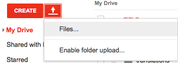

After it finishes uploading and converting, you'll be able to click its name to view the Spreadsheet.


Tada! It worked.

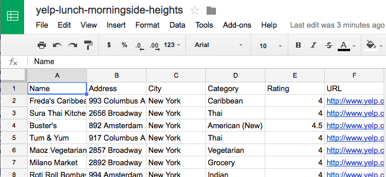

## Adding a Geocodeable Column

Now we need to create a column that will contain the full address - street address with the city and state. In *theory* the MapBox plugin we're using doesn't require this, but I think it's good form, and who knows when you might have to use a different plugin?

Select column F (the URL) and Choose `Insert > Column Right` from the top menu.

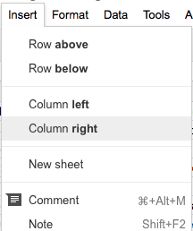

Let's name that `Full Address`. We'll want to combine the `Address` and `City` fields, then add "New York" as the state.

To do this, we'll need to write a formula. Adding multiple strings together is called **concatenation**, and that's exactly the name of the method we'll use.

Click in column G2 and start typing `=CONCA`. You'll see two autocomplete options - `CONCAT` and `CONCATENATE`. You want the second one, since it lets you concatenate an arbitrary number of values (we'll be doing three).

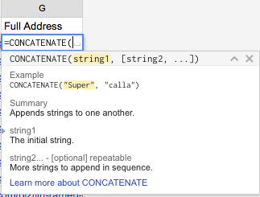

Pretty nice docstring, right? If you haven't worked with formulas in a spreadsheet before, this part is simple enough.

The first thing we want to combine is the street address, so click the `B2` column and watch it auto-fill into the formula. Then type a `,` so we can pass it another value.

**You don't pass it the city right now**. You need a space, first! So the second value is actually a space in quotes - `" "`. Then add another comma and click C2, the city.

Then add a final argument to finish it off, passing a comma and the state - `", New York"`. Close the parenthesis off and your formula should look something like `=CONCATENATE(B2," ",C2,", New York")`.

## Extending the formula down

Are we going to type this for every single row? No. That's insane. Some people click and dddrrraaaaggg the blue square in the corner, but I've got an even better way.

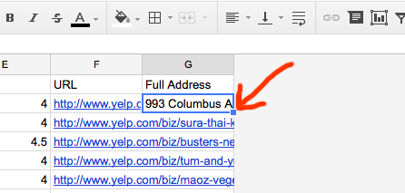

**Secret trick:** Select the cell with the formula and double-click the square in the bottom right-hand corner. The formula will fill up the entire column!

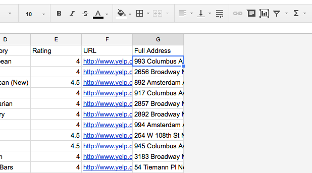

## Installing the Geocoding Extension

You'll need to install a MapBox add-on to this Google Spreadsheet in order to geocode. There are a *lot* of different plugins to geocode in Google Spreadsheets, and about 90% of them don't work or give unreliable results. Here's hoping!

> **Note**: I'm just taking the directions from [here](https://github.com/mapbox/geo-googledocs#installation) and adding a few pictures.

First, you'll want to visit `Tools > Script Editor`.

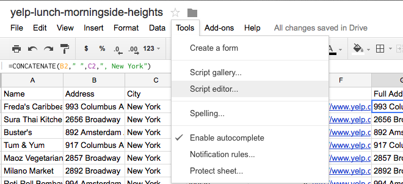

And on the next screen, even though we're working from a Spreadsheet you'll want to select `Blank Project`. Selecting `Spreadsheet` will give you a bunch of boilerplate code that we won't be using.

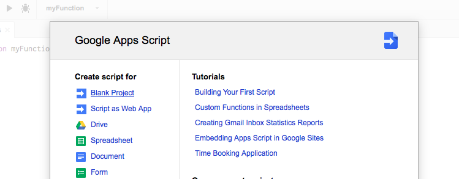

Now copy the code from [MapBox.js](https://raw.githubusercontent.com/mapbox/geo-googledocs/master/MapBox.js) into the pane on the right.

Click *Untitled Project* up on the top and rename it to **geo**.

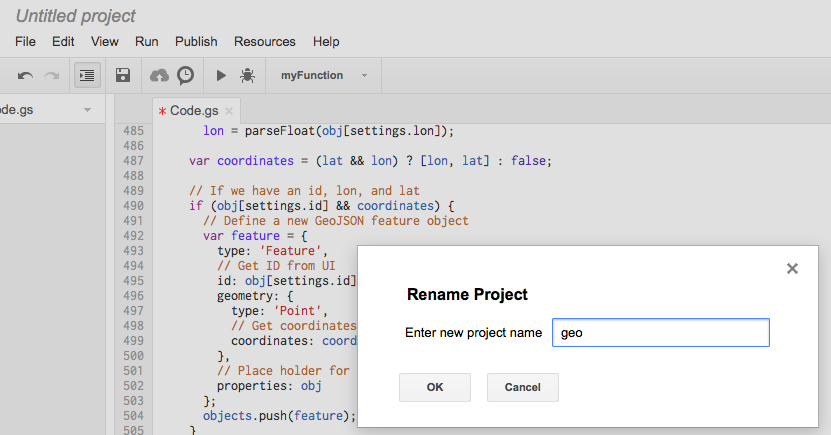

Save using `File > Save`, quit the project, and refresh your spreadsheet. You should have a brand-new menu dropdown called `Geo`!

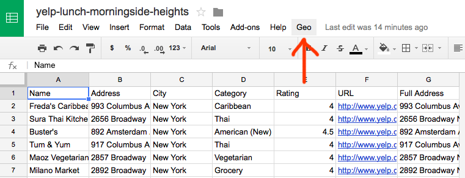

## Geocoding

Now it's time to finally turn those addys into **lats and lons**!

> **Note**: No one can  figure out wehther the right abbreviation for longitude is **long**, **lon**, or **lng**. Blood has been spilled, probably.

You'll be given a few choices to use for your geocoding service. [Yahoo BOSS Geo Services](https://developer.yahoo.com/boss/geo/) (Yahoo Placefinder) is high-quality but you have to give them credit card info. They do give you 10,000 free geocodes a day, though. You can also select **MapQuest** and not provide an API key (...although you'll be breaking some rules).

Now head back to your spreadsheet. Click `G` to select the entire Full Address column. Then `Geo > Geocode Addresses`.


Google Spreadsheets will then ask for **Authorization to run**. Tell it to do whatever it wants, and if you don't necessarily trust it remember [you have all of the source code](https://raw.githubusercontent.com/mapbox/geo-googledocs/master/MapBox.js) if you'd like to inspect it.

Eventually geocoding will finish and you'll be presented with a triumphant **Geocoding is done!** message, and you'll have three new fields in your table - geo_latitude, geo_longitude, and geo_accuracy.


## Importing into TileMill

You used to be able to use the Publish-to-Web feature of Google Spreadsheets to import the document, but not any more! You'll need to `File > Download as... > Comma separated values`


Then you'll just import it right into TileMill.

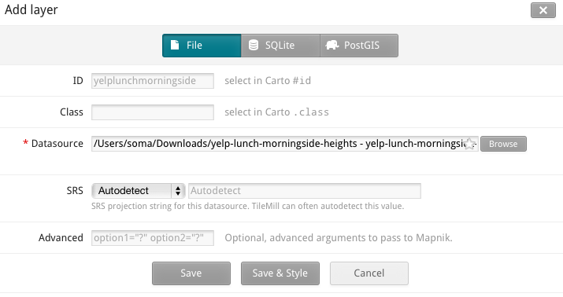

Zoom to Extent and you're good to go!


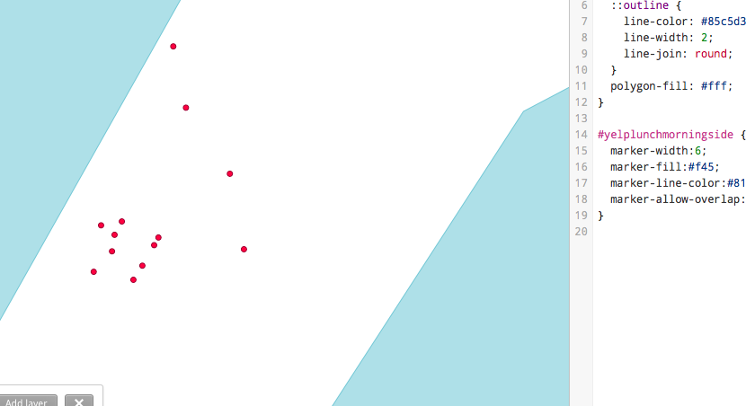

## Prettification

First let's get a basemap reference layer in there - last time we used `examples.map-20v6611k` in the settings (the little wrench icon)


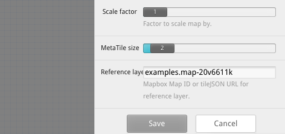

Can't see that setting? Visit your **Plugins** tab and install **tilemill-reference-layer**.

Once that's done, delete the `#countries` layer along with the `Map` and `#countries` styles.

Now bring up the attributes table to see what fields we can make style rules around.


Rating looks good! Since it's actually a number and not a string this time, we can do fun stuff in styling like

```css
#yelplunchmorningside {
  marker-width:6;
  marker-fill:#f45;
  marker-line-color:#813;
  marker-allow-overlap:true;
  [Rating >= 4] {
    marker-width: 10;
    marker-fill: #ff0;
    marker-line-color:#660;
  }
}
```

to make better-rated places stand out a bit more.


## Publishing

You'll want to follow the directions in the hurricane evacuation center document - it's one and the same!