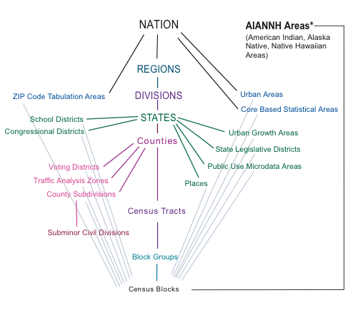

# The Census + a Bit about Mapping

First, [a couple maps](http://project.wnyc.org/median-income-nation/) [from WNYC](http://project.wnyc.org/census-maps/nyc-diversity/) for inspiration.

If you have Census questions, someone else probably already asked it! Try out the [Census Bureau FAQ's](https://ask.census.gov) for some answers.

## Different Surveys

It isn't just **one big CENSUS!!!** It's one big Census and a [million other censuses](https://www.census.gov/programs-surveys/are-you-in-a-survey/survey-list.html). Let's review a few of them.

### The Census

This is the big one, done every ten years.

### American Community Survey (ACS)

ACS is done every year a limited capacity, and data is released on a 1-, 3-, and 5-year basis. That way you can pick and choose between recency and completeness. According to the Census, it asks about...

- age
- sex
- race
- family and relationships
- income and benefits
- health insurance
- education
- veteran status
- disabilities
- where you work and how you get there
- where you live and how much you pay for some essentials

Which covers pretty much anything you need for a story about a community.

### A few others

[Survey of Income and Program Participation](https://www.census.gov/programs-surveys/sipp.html) (SIPP)
[Current Population Survey](https://www.census.gov/cps/) (CPS)
[Consumer Expenditure Survey](http://www.bls.gov/cex/) (CE)
[National Health Interview Survey](http://www.cdc.gov/nchs/nhis.htm) (NHIS)

...and a ton of others. I generally stick to ACS, but you might find fun data sets elsewhere, too!

## The Data

They do a decent job of [making information available on the site](https://www.census.gov/data/data-tools.html)

### Online Tools

- [American FactFinder](http://factfinder2.census.gov/faces/nav/jsf/pages/index.xhtml)
- [Census Explorer](https://www.census.gov/censusexplorer/)
- [QuickFacts](http://quickfacts.census.gov/qfd/)
- [Interactive Population Map](https://www.census.gov/2010census/popmap/)
- [Social Explorer metadata](http://www.socialexplorer.com/data/metadata/)

...and [many more](https://www.census.gov/data/data-tools.html)

### Data sets

They have a [developer section](https://www.census.gov/developers/) and a [data discovery tool](https://www.census.gov/data/developers/updates/new-discovery-tool.html)

## Geography

Census geography is broken down into a million and one (sometimes-confusing) ways.

### Available Slices

[Lots of them](http://mcdc.missouri.edu/allabout/sumlevs/)

States, counties, MSA, block groups, blocks, tracts

[Metropolitan Statistical Areas](http://en.wikipedia.org/wiki/Metropolitan_statistical_area) are high-density areas that are closely related, ie. Thereare [388 in the USA](http://en.wikipedia.org/wiki/List_of_Metropolitan_Statistical_Areas), as you can see [on this map](cbsa_us_1209_large). The one NYC is a part of is [right here](New_York_Metropolitan_Area_Counties_2013).
 
[Census Tracts](http://en.wikipedia.org/wiki/Census_tract) are among the smallest division. They can be divided into [census block groups](http://en.wikipedia.org/wiki/Census_block_group) and then again into [census blocks](http://en.wikipedia.org/wiki/Census_block). You can see a map of NYC census tracts at [http://maps.nyc.gov/census/](http://maps.nyc.gov/census/).

* 1 block group contains, on average, 39 blocks
* Block groups have between 600-3000 people
* Blocks have a 12-digit FIPS code
* The USA contains ~8 million census blocks, ~200k block groups, and ~50 census blocks

[ZIP Code Tabulation Areas](http://en.wikipedia.org/wiki/ZIP_Code_Tabulation_Area) are *almost, kind of* ZIP codes. There are 32,000 ZCTA's.

### FIPS

[State codes](http://en.wikipedia.org/wiki/FIPS_state_code)
[County codes](http://mcdc.missouri.edu/websas/geocorr90_htmls/counties.html)

Census tract numbers

You can find FIPS codes [by address](http://factfinder2.census.gov/faces/nav/jsf/pages/searchresults.xhtml?ref=addr&refresh=t)
GNIS

### GIS files

GIS stands for Geographic Information Systems, and basically means "computer map stuff." You join these maps to your data programmatically, and voila! You've got a nice map.

### Geography

The Census releases a set of data called TIGER (Topologically Integrated Geographic Encoding and Referencing) that illustrates all of the levels of geography that they cover. 

The [TIGER/Line files](http://www.census.gov/geo/maps-data/data/tiger.html) and related geographic data sets are [available on census.gov](http://www.census.gov/geo/maps-data/data/tiger.html), but there are some caveats!  They often include parts of the ocean, are only available on a state-level basis, or are only available in Geodatabase format (which only ArcGIS can use). If you're planning on mapping, you might want to check out NHGIS down below for a more user-friendly format.

In theory you can browse TIGER divisions at [TigerWeb](http://tigerweb.geo.census.gov/tigerweb/), but I've found it nigh unuseable.

And oh my god, the TIGER logo is *incredible*
http://en.wikipedia.org/wiki/Topologically_Integrated_Geographic_Encoding_and_Referencing#mediaviewer/File:US-Census-TIGERLogo.svg

#### File formats

In the world of GIS, there are a few different file formats. Sometimes you need to convert between them and it can be a pain, but 

##### Shapefiles*

*File format: .shp + optional .dbf/.shx/.prj*

Shapefiles are the standard format for passing around geographic information. It comes with a few pieces...

- The `shp` file is the actual geographic information
- The `prj` file explains what kind of [projection](http://en.wikipedia.org/wiki/Map_projection) is being used (hope it isn't a [state plane system](http://en.wikipedia.org/wiki/State_Plane_Coordinate_System))
- The `dbf` file has the information associated with each element of the shapefile - city name, or population count, or whatever other data you're storing
- The `shx` is an index file that speeds up a program working on the shapefile

##### Geodatabases

*File format: .gdb*

Geodatabases are a headache, and aren't well-supported on OS X. I don't know much about them as a result.

##### GeoJSON/TopoJSON

*File formats: .json, .geojson, .topojson*

JSON that supports geographic stuff! Written by developers instead of a standards group, it's especially popular among JavaScript applications.

If you need to write or edit smaller GeoJSON files, check out [geojson.io](http://geojson.io/).

**TopoJSON** is an extension of GeoJSON that allows for smaller file sizes. Instead of California having a western border and Nevada having an eastern border, TopoJSON collapses them into a single line and calls it a day.

##### Keyhole Markup Language (KML)

*File format: KML*

You see this a lot with Google. Not generally around for more serious GIS work, I don't think.

## NHGIS: National Historical Geographic Information System

A project of the University of Minnesota, the [National Historical Geographic Information System](https://www.nhgis.org) (NHGIS) organizes and archives Census data. Easy to browse, easy to download - they're frankly leagues ahead of the Census itself.

They coordinate data samples across years, fill in gaps, and make a lot of notes about gotchas from different versions of the Census. They're also a great resource for GIS files to maps with your data!

Their datasets go back to *1790* and they aim to releases data sets on NHGIS within 6 weeks of being released by the Census

## IPums

https://usa.ipums.org/usa/

## Accessing data

### NHGIS

You browse it, you download datasets, there you go.

https://www.nhgis.org

### The Census API

Visiting https://www.census.gov/data/developers/data-sets/acs-survey-5-year-data.html you see how you can make an API call directly. Let's look at that.

http://api.census.gov/data/2012/acs5/profile?get=NAME,DP02_0001PE&for=state:*&key=PUT_KEY_HERE

It looks like dogs.csv, kind of, with that header row and everything. Do we... cut and paste it into Python? Instead, let's find a module that does the hard work for us.

https://github.com/sunlightlabs/census